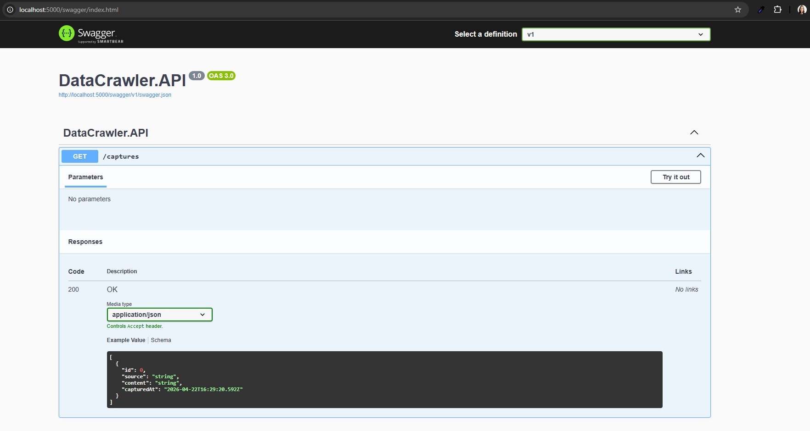
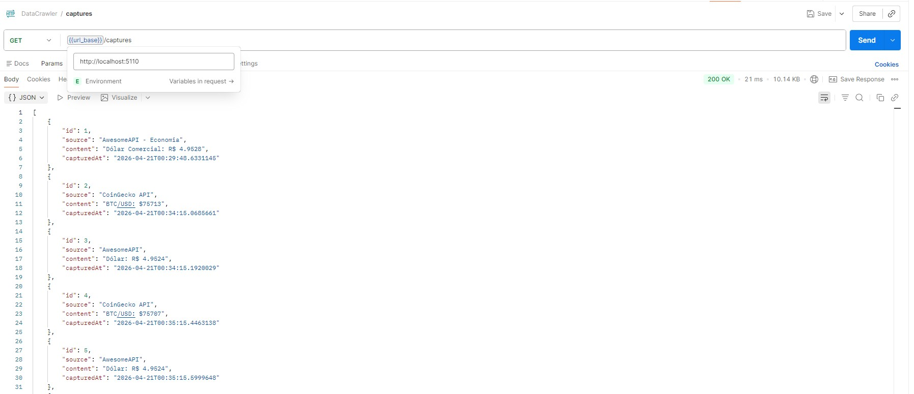

# DataCrawler: RPA & Web API (.NET 8)

[Português](#portugues) | [English](#english)

---


## Português

Este projeto consiste em um ecossistema de captura de dados (Web Scraping) e disponibilização via API REST, focado em **resiliência**, **separação de responsabilidades** e **Clean Code**.

---

## Arquitetura do Sistema

O projeto utiliza uma arquitetura modular, dividida em três componentes principais para garantir o princípio de **Responsabilidade Única (SoC)**:

| Componente               | Função                                                                                         |
| :----------------------- | :--------------------------------------------------------------------------------------------- |
| **`DataCrawler.Worker`** | Background Service responsável pelo "robô" RPA que executa a captura de dados.                 |
| **`DataCrawler.API`**    | Minimal API de alta performance que expõe os dados capturados para consumo.                    |
| **`DataCrawler.Shared`** | Biblioteca de classes que centraliza Models e o Contexto do Banco, evitando duplicidade (DRY). |

---

## Tecnologias Utilizadas

* **Framework:** .NET 8 (C#)
* **ORM:** Entity Framework Core
* **Banco de Dados:** SQLite
* **Scraping:** HtmlAgilityPack & HttpClient
* **Containers:** Docker & Docker Compose
* **Documentação:** Swagger (OpenAPI)

---

## Resiliência e Engenharia

1. **Self-Healing Database:** O sistema detecta a ausência do banco e o recria automaticamente via `db.Database.EnsureCreated()`.
2. **Gerenciamento de Escopo:** uso de `IServiceProvider` para evitar memory leaks.
3. **Fault Tolerance:** Implementação de blocos try-catch isolados para cada fonte de dados (CoinGecko e AwesomeAPI), se um serviço externo falhar, o robô continua operando e processando as demais capturas sem interromper o serviço.
4. **DRY:** camada compartilhada (`Shared`), facilitando a manutenção e garantindo integridade entre API e Worker.

---

## Como Executar

1. Clone o repositório.
2. Na raiz do projeto, execute o comando:

```bash
docker-compose up --build
```

Acesse a API em: [http://localhost:5000/captures](http://localhost:5000/captures)

---

## Demonstração

### Swagger



### Postman



---

## Endpoints

| Método | Endpoint  | Descrição                 |
| :----- | :-------- | :------------------------ |
| GET    | /captures | Lista de dados capturados |

### Exemplo JSON

```json
[
  {
    "id": 1,
    "source": "CoinGecko API",
    "content": "BTC/USD: $77208",
    "capturedAt": "2026-04-21T23:50:02"
  }
]
```

---

## Decisões de Desenvolvimento

* Docker com volume compartilhado (Worker escreve, API lê)
* Minimal APIs para performance
* Inspiração em arquitetura Java/Spring adaptada ao .NET

---


## English


This project consists of a data capture ecosystem (Web Scraping) and a REST API, focused on **resilience**, **separation of concerns**, and **Clean Code**.

---

## System Architecture

| Component                | Function                             |
| :----------------------- | :----------------------------------- |
| **`DataCrawler.Worker`** | Background Service responsible for the RPA bot that executes data capture. | 
| **`DataCrawler.API`** | High-performance Minimal API that exposes captured data for consumption. | 
| **`DataCrawler.Shared`** | Class Library that centralizes Models and Database Context, avoiding duplication (DRY). |

---

## Technologies

* .NET 8 (C#)
* Entity Framework Core
* SQLite
* HtmlAgilityPack & HttpClient
* Docker
* Swagger

---

### Resilience and Engineering 
1. **Self-Healing Database:** The system detects database absence and automatically recreates it via `db.Database.EnsureCreated()`.
2. **Scope Management:** Use of `IServiceProvider` within the Worker's main loop to create manual scopes, ensuring `AppDbContext` and other services are correctly disposed of in each cycle, preventing **Memory Leaks**.
3. **Fault Tolerance:** Implementation of isolated try-catch blocks for each data source (CoinGecko and AwesomeAPI). If one external service fails, the bot continues to operate and process other captures without downtime.
4. **DRY (Don't Repeat Yourself):** Refactoring the data layer into a Shared project, facilitating maintenance and ensuring integrity between API and Worker.

---

## How to Run
1. Clone the repository.
2. In the project root, run:

```bash
docker-compose up --build
```

Access the API at: [http://localhost:5000/captures](http://localhost:5000/captures)

---

## System Demonstration

### Swagger interface


### API response in Postman


---

## Endpoints

| Method | Endpoint  | Description           |
| :----- | :-------- | :-------------------- |
| GET    | /captures | | Returns the complete list of captured data. |

### Example

```json
[
  {
    "id": 1,
    "source": "CoinGecko API",
    "content": "BTC/USD: $77208",
    "capturedAt": "2026-04-21T23:50:02"
  }
]
```
